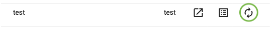

We now have a page with two input fields and a button. Data can be entered in these fields but the form does not save yet becuase we haven't added an action to the button.

We will add an action to our button.

1. Go to the Admin Module
1. Select the Admin Module Menu
1. Select 'Page Management'
1. Select 'Setup Pages'
1. Select the Form Actions icon 

6. Select 'Add' to add a form action.
1. Select the Form Action dropdown and choose "500 - Submit Form"
1. Enter a name in Action Name - For example, "Save"
1. Select the Button field and select our button from the dropdown.

10. Select "Save"

Our page will not change appearance but the button will now save the data.

---

Our next step is view the submitted form data.