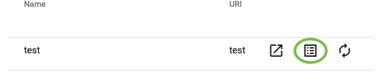

Various form elements can be added to a page. There are two types of form elements:

1. [Form Controls](/docs/features/formcontrols) - includes fields for data entry, widgets, display areas and more.
1. [Form Actions](/docs/features/formactions) - these help provide navigation, sending emails, saving data to the CRM and  more.

---

We will start by adding a heading to our page.

1. Go to the Admin Module
1. Select the Admin Module Menu
1. Select 'Page Management'
1. Select 'Setup Pages'
1. Select the Form Control Icon 

6. Select 'Add' to add a form control.
1. Enter a Name - For example, "form heading"
1. Select the Type dropdown and choose "HTML WYSIWYG Area"
1. Width can remain as "0" to show the default width. This can be changed later if necessary
1. Within the WYSIWYG area type a heading - For example, "My First Form"
1. Check the box "Divider After". This will ensure the next element we add will appear below the heading.

1. Select "Save"
---
Our next step is to add some input fields on our page.